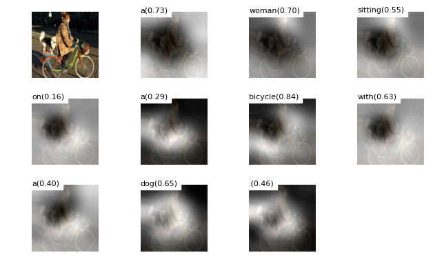

# Show, Attend and Tell 

## What's new

This repository is a clone and update of an open source Show-Attend-and-Tell image captioning implementation on TensorFlow by [yunjey](https://github.com/yunjey/show-attend-and-tell). The following new features are added to this release:

- Updates to TensorFlow 1.3 and 1.4 and some bug fixes
- Provides an option to uses inception-v3 as the CNN for feature extraction, with better captioning performance
- Adds a front end script for running inference directly from an image (.jpg, .png) input
- Includes a pretrained model

The training process still depends on python 2 as it requires the coco-caption package. However the inference script and the entire model have been updated to run flawlessly in python 3.


## References

TensorFlow implementation of [Show, Attend and Tell: Neural Image Caption Generation with Visual Attention](http://arxiv.org/abs/1502.03044) which introduces an attention based image caption generator. The model changes its attention to the relevant part of the image while it generates each word.

<br/>


<br/>

yunjey's [TensorFlow implementation](https://github.com/yunjey/show-attend-and-tell)

Author's theano code: https://github.com/kelvinxu/arctic-captions 

Another tensorflow implementation: https://github.com/jazzsaxmafia/show_attend_and_tell.tensorflow

<br/>


## Getting Started

### Prerequisites

First, clone this repo and [pycocoevalcap](https://github.com/tylin/coco-caption.git) in same directory.

```bash
$ git clone https://github.com/huanzhang12/ShowAttendAndTellModel.git
$ git clone https://github.com/tylin/coco-caption.git
```

This code is written in Python2.7 and requires [TensorFlow](https://www.tensorflow.org/versions/r0.11/get_started/os_setup.html#anaconda-installation). In addition, you need to install a few more packages to process [MSCOCO data set](http://mscoco.org/home/). 
I have provided a script to download the <i>MSCOCO image dataset</i>, [VGGNet19 model](http://www.vlfeat.org/matconvnet/pretrained/). and Inception-V3 model. 
Downloading the data may take several hours depending on the network speed. Run commands below then the images will be downloaded in `image/` directory and <i>VGGNet19 model</i> and <i>Inception-V3 model</i> will be downloaded in `data/` directory.

**If you just want to use the pretrained model**, you don't need to run download_data.sh as it will take some time to download the full MSCOCO dataset.

```bash
$ cd ShowAttendAndTellModel
$ pip install -r requirements.txt
$ chmod +x ./download_data.sh
$ chmod +x ./download_model.sh
$ ./download_data.sh
$ ./download_model.sh
```

### Using the Pretrained Model

The pretrained model uses the Inception-V3 model, and has been extracted to `model_best` folder in the `download_data.sh` script.
Use the `run_inference.py` script (should work in both python2 and python3) for inference. 
COCO_val2014_000000386968.png is a sample MSCOCO validation image (included in this repository for convenience).

```bash
$ python run_inference.py --use_inception COCO_val2014_000000386968.png
```

To see where the model attends, run

```bash
$ python run_inference.py --use_inception --visualize COCO_val2014_000000386968.png
```

And then an image `COCO_val2014_000000386968_att.png` will be generated with attention of each word:



The pretrained model using Inception-V3 achieves the following performance metrics on MSCOCO validation set. 

```
Bleu_1: 0.703627089161
Bleu_2: 0.501729840869
Bleu_3: 0.35029232863
Bleu_4: 0.242830720963
ROUGE_L: 0.540511360262
CIDEr:  0.799597591723
```

As a comparison, here are the performance metrics achieved by using VGG as the CNN (according to [yunjey](https://github.com/yunjey/show-attend-and-tell/blob/master/evaluate_model.ipynb)):

```
Bleu_1: 0.661369887927
Bleu_2: 0.452824472132
Bleu_3: 0.310364129211
Bleu_4: 0.217912572998
METEOR: 0.217213601321
ROUGE_L: 0.518324778652
CIDEr:  0.683173385807
```

Clearly, Inception-V3 provides significantly better performance than VGG.
These numbers can be futher improved if a beam search is used
(currently, beam search is not implemented in this code base).

### Train the model

To use the Inception-V3 model (with better performance than VGG), an new command line argument, `--use_inception` has been added to all relevant scripts.

For feeding the image to the <i>Inception-V3</i>, you should resize the <i>MSCOCO image dataset</i> to the fixed size of 299x299. 
For feeding the image to the <i>VGGNet</i>, you should resize the <i>MSCOCO image dataset</i> to the fixed size of 224x224. Run command below then resized images will be stored in `image/train2014_resized/` and `image/val2014_resized/` directory.

```bash
$ python resize.py --use_inception
```

Before training the model, you have to pre-process the <i>MSCOCO caption dataset</i>.
To generate caption dataset and image feature vectors, run command below.

```bash
$ python prepro.py --use_inception
```
<br>

To train the image captioning model, run command below. 

```bash
$ python train.py --use_inception
```
<br>

### (optional) Tensorboard visualization

I have provided a tensorboard visualization for real-time debugging.
Open the new terminal, run command below and open `http://localhost:6005/` into your web browser.

```bash
$ tensorboard --logdir='./log' --port=6005 
```
<br>

### Evaluate the model 

To generate captions, visualize attention weights and evaluate the model, please see `evaluate_model.ipynb`.


<br/>

## Results
 
Note: these results were generated using the VGG model as CNN.

<br/>

#### Training data

##### (1) Generated caption: A plane flying in the sky with a landing gear down.


##### (2) Generated caption: A giraffe and two zebra standing in the field.


#### Validation data

##### (1) Generated caption: A large elephant standing in a dry grass field.


##### (2) Generated caption: A baby elephant standing on top of a dirt field.


#### Test data

##### (1) Generated caption: A plane flying over a body of water.


##### (2) Generated caption: A zebra standing in the grass near a tree.


